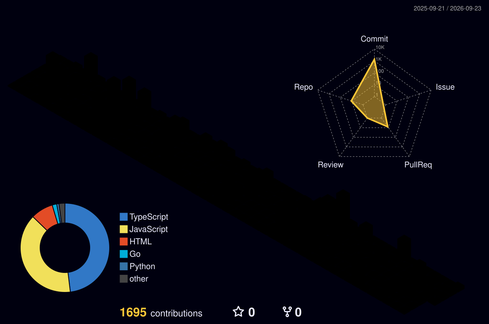

<h1 align="center">Hi 👋, I'm Sasikiran TT</h1>
<h3 align="center">
Full Stack Developer • UI/UX Designer • AI Enthusiast • Founder of Techno Vanam
</h3>

---

<h2>

About Me
</h2>

- 💻 Full Stack Web Developer
- 🎨 Passionate UI/UX Designer
- 🚀 Founder of **Techno Vanam**
- 🤝 Open to Open Source Contributions
- 📫 Reach me at **sasikiran.tt3011@gmail.com**

---

<h2>

Achievements
</h2>

---

<h2>

Tech Stack
</h2>

### Languages

### Frontend

### Backend

### AI / ML

### Tools

---

<h2>

Development Metrics
</h2>

### 📊 Code & Contribution Dynamics

  
  

### 🔤 Language Breakdowns

  
  

### 📈 Global Repository Stats

  
  

  

---

<h2>

GitHub Overview
</h2>

---

<h2>

Contribution Activity
</h2>

---

<h2>

Contribution Snake Animation
</h2>

---

<h2>

3D Contribution Calendar
</h2>

---

<h2>

Connect With Me
</h2>

---

<b>Profile Views</b> 

<i>"Code. Create. Innovate. Repeat."</i>

